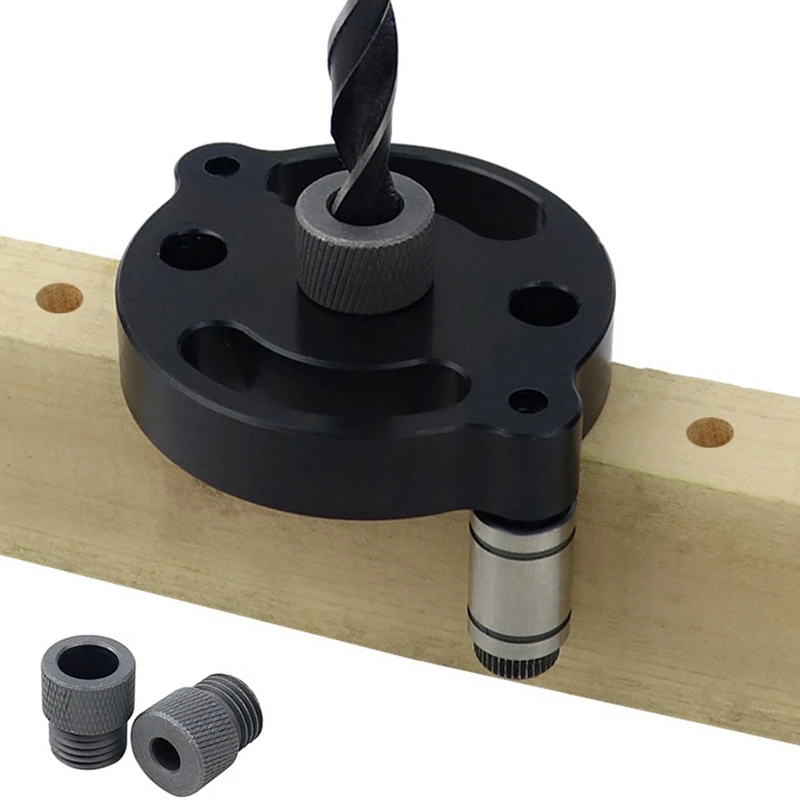
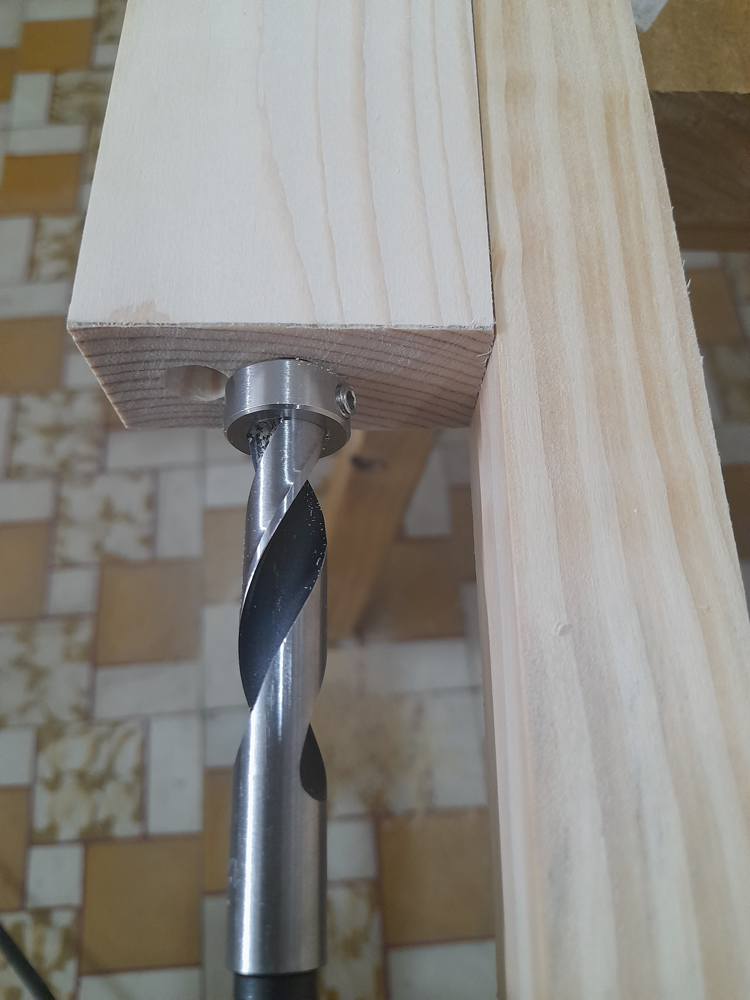
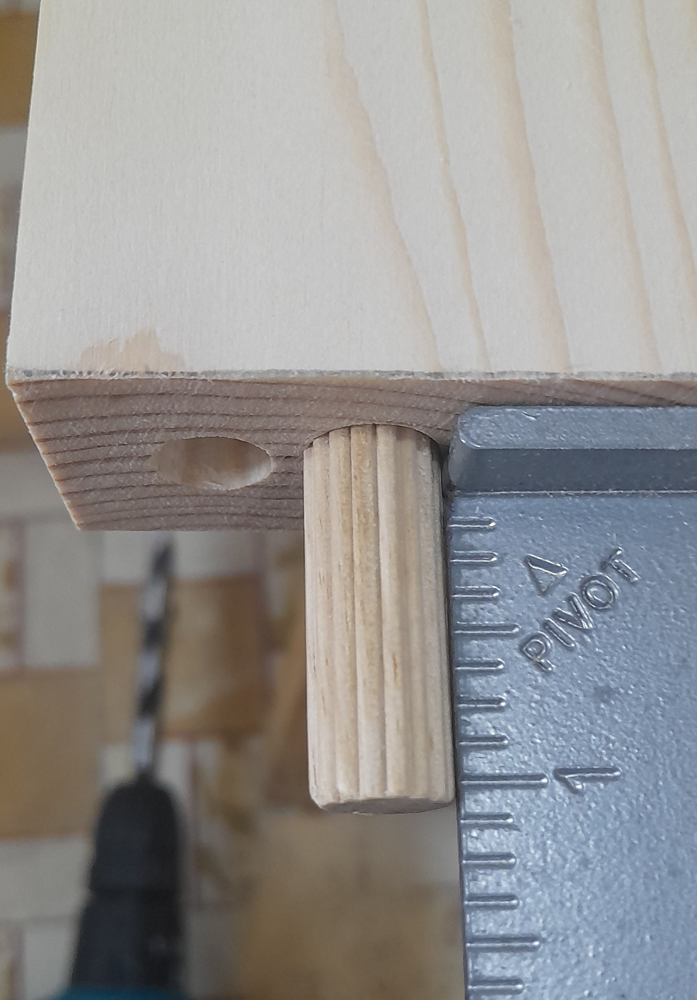
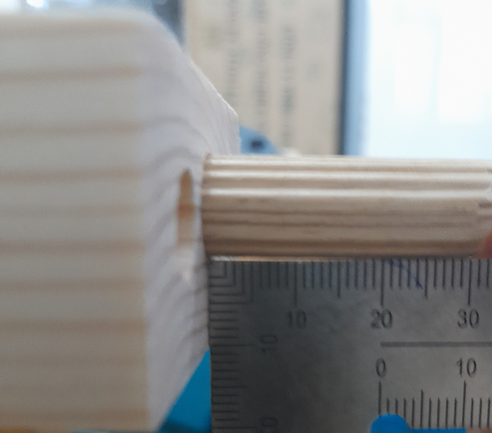

# drill straight holes in wood end-grain without a jig

I was trying to drill straight holes in wood end-grain to make dowel joints. So I bought this jig

 

*Source: AliExpress*

But my wood plank's end-grain is too small for this jig to be stable. I tried to hold the jig with my hand (It's dangerous, do not try this) but the drill bit is still jiggle.

Desperately, I used another straight wood plank as a reference to eyeball the drill bit along left-right axis.

For up-down axis, I eyeballed the drill bit along it once then tried to hold my drill straight.

The result is quite good

The dowel is slightly crooked along up-down axis. But it is usable.

I'll add a bubble level indicator to guide my drill straight along up-down axis.

I'm happy with this technique.